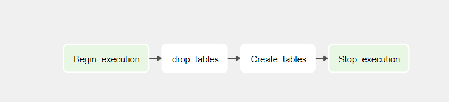
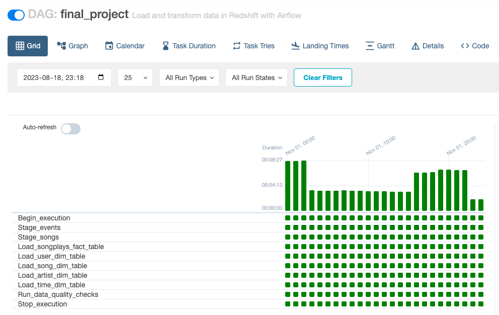
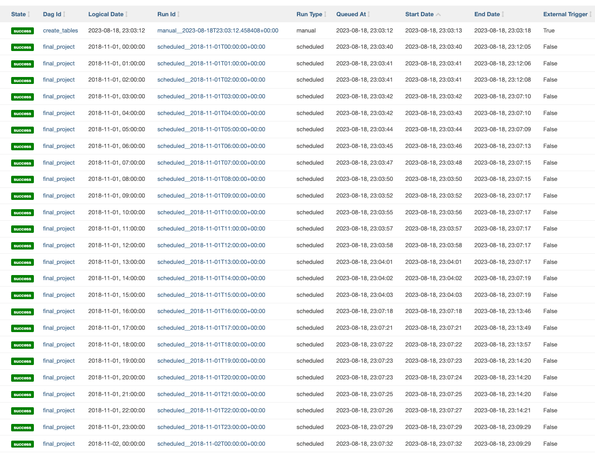

## Airflow Data pipeline 

### Copy S3 Data

* Create a project S3 bucket using the AWS Cloudshell

    ```sh
    aws s3 mb s3://anhvu-pj/
    ```

* Copy the data from the udacity bucket to the home cloudshell directory: 

    ```sh
    aws s3 cp s3://anhvu-pj/log-data/ ~/log-data/ --recursive
    aws s3 cp s3://anhvu-pj/song-data/ ~/song-data/ --recursive
    ```

* Copy the data from the udacity bucket to the home cloudshell directory: 

    ```sh
    aws s3 cp ~/log-data/ s3://anhvu-pj/log-data/ --recursive
    aws s3 cp ~/song-data/ s3://anhvu-pj/song-data/ --recursive
    ```

* List the data in bucket to be sure it copied over: 

    ```sh
    aws s3 ls s3://anhvu-pj/log-data/
    aws s3 ls s3://anhvu-pj/song-data/
    ```

### Airflow DAGs 

#### 1. `create_tables` DAG overview



#### Operators 
* `Begin_execution` & `Stop_execution`

    Dummy operators representing DAG start and end point 
* `Create_tables`

    Create tables in Redshift
#### 2. `final_project` DAG overview


#### Operators 
* `Begin_execution` & `Stop_execution`

    Dummy operators representing DAG start and end point 
* `Stage_events` & `Stage_songs`

    Extract and Load data from S3 to Amazon Redshift
* `Load_songplays_fact_table` & `Load_*_dim_table`

    Load and Transform data from staging to fact and dimension tables
* `Run_data_quality_checks`

    Run data quality checks to ensure no empty tables
  
  * `Create_tables-operator`

    Create tables (staging, fact, dimension) if not exists in databases

  * `Create_tables-operator`
    Drop tables (staging, fact, dimension) if exists in databases

### Execution
1. Create S3 bucket and copy data from source
2. Set Up AWS and Airflow Configurations
3. Run `create_tables` DAG to create tables in Redshift
4. Run `finaly_project` DAG to trigger the ETL data pipeline

#### Successful DAG runs





## AWS and Airflow Configurations

#### 1. Create an IAM User `awsuser` in AWS 
_Permissions - attach exiting policies:_
* Administrator Access
* AmazonRedshiftFullAccess
* AmazonS3Full Access

#### 2. Configure AWS Redshift Serverless
* Create a Redshift Role `my-redshift-service-role` from the AWS Cloudshell
* Give the role S3 Full Access

    ```sh
    aws iam attach-role-policy --policy-arn arn:aws:iam::aws:policy/AmazonS3FullAccess --role-name my-redshift-service-role
    ```
* Setup AWS Redshift Serverless
    * Copy and store the Redshift Workgroup endpoint locally, we will need this while configuring Airflow (`redshift` connection)
#### 3. Configure Connections in Airflow UI
_Add Airflow Connections:_
* Connection ID: `aws_credentails`, Connetion Type: `Amazon Web Services`
* Connection ID: `redshift`, Connetion Type: `Amazon Redshift`

#### 4. Configure Variables in Airflow UI - S3 Paths
* `Key` = `s3_bucket`
* `Value` = `anhvu-pj` (bucket name)
